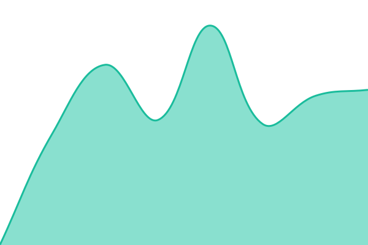
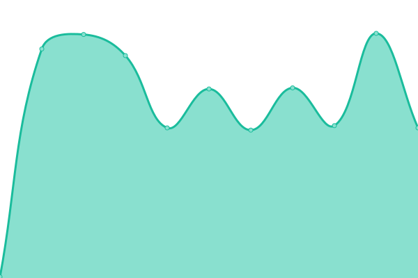

# [📈 Live Status](https://upptime.github.io/upptime): <!--live status--> **🟩 All systems operational**

This repository contains the open-source uptime monitor and status page for [Upptime](https://upptime.js.org), powered by [Upptime](https://github.com/upptime/upptime).

With [Upptime](https://upptime.js.org), you can get your own unlimited and free uptime monitor and status page, powered entirely by a GitHub repository. We use [Issues](https://github.com/upptime/upptime/issues) as incident reports, [Actions](https://github.com/upptime/upptime/actions) as uptime monitors, and [Pages](https://upptime.github.io/upptime) for the status page.

<!--start: status pages-->
<!-- This summary is generated by Upptime (https://github.com/upptime/upptime) -->
<!-- Do not edit this manually, your changes will be overwritten -->
<!-- prettier-ignore -->
| URL | Status | History | Response Time | Uptime |
| --- | ------ | ------- | ------------- | ------ |
|  [www.laprovence.com](https://www.laprovence.com) | 🟩 Up | [www-laprovence-com.yml](https://github.com/TechLaProvence/status-page/commits/HEAD/history/www-laprovence-com.yml) | 

 987ms
     
 | 

<a href="https://upptime.github.io/upptime/history/www-laprovence-com">100.00%</a>
    

|  [www.corsematin.com](https://www.corsematin.com) | 🟩 Up | [www-corsematin-com.yml](https://github.com/TechLaProvence/status-page/commits/HEAD/history/www-corsematin-com.yml) | 

 561ms
     
 | 

<a href="https://upptime.github.io/upptime/history/www-corsematin-com">100.00%</a>
    

|  [www.latribune.fr](https://www.latribune.fr) | 🟩 Up | [www-latribune-fr.yml](https://github.com/TechLaProvence/status-page/commits/HEAD/history/www-latribune-fr.yml) | 

 158ms
     
 | 

<a href="https://upptime.github.io/upptime/history/www-latribune-fr">100.00%</a>
    

|  [n8n-la-provence-production](https://n8n-app-405115047504.europe-west1.run.app) | 🟩 Up | [n8n-la-provence-production.yml](https://github.com/TechLaProvence/status-page/commits/HEAD/history/n8n-la-provence-production.yml) | 

 213ms
     
 | 

<a href="https://upptime.github.io/upptime/history/n8n-la-provence-production">100.00%</a>
    

<!--end: status pages-->

[**Visit our status website →**](https://upptime.github.io/upptime)

## 📄 License

- Powered by: [Upptime](https://github.com/upptime/upptime)
- Code: [MIT](./LICENSE) © [Anand Chowdhary](https://anandchowdhary.com), supported by [Pabio](https://pabio.com)
- Data in the `./history` directory: [Open Database License](https://opendatacommons.org/licenses/odbl/1-0/)
